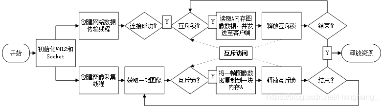
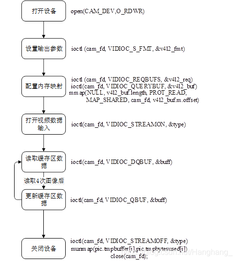
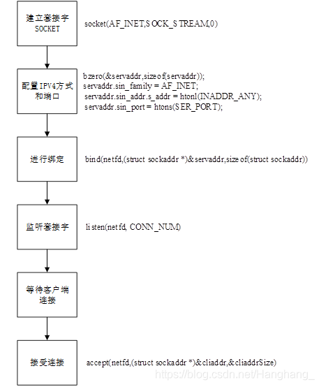

### 简易版的mjpg-streamer

这是一个简易版的mjpg-streamer。

功能：将摄像头的图像数据通过http协议实时推流到网页。**可以将Linux下使用摄像头+WIFI传输图像**，简单来说就是一个简单的无线图传。

关键词：V4L2 SOCKET HTTP

# 工程结构

要想实现无线图传，主要分为三个要点，一个是实现图像的获取，另一个是实现网络的传输，最后是要考虑图像获取和网络传输如何结合起来。下面的图大致地描述了整个工程的思路，主要是参考了mjpg-streamer的思路。

## 1 采集图像

采集摄像头数据使用Linux下的视频采集框架V4L2（Linux for Video 2）。直接提取MJPEG并保存为JPEG格式就可以直接在电脑上显示了。

## 1.1 MJPEG和JPEG的区别

在电脑能直接显示MJPEG数据的JPEG格式的图像，但这并不意味着这两种格式（MJPEG和JPEG）就没有区别，关于这个区别，在谷歌也没有很多的资料，以下是谷歌出来的区别：

1、JPEG是单页文件格式。Motion JPEG是静态照片的JPEG标准的动态视频改编。MJPEG将视频流视为一系列静态照片，单独压缩每个帧，不使用帧间压缩。

2、使用MJPG像素格式，帧率更高（约30 fps），每帧的字节6,7,8,9（从0开始索引）为’J’，‘F’，‘I’，‘F’ 。如果我使用JPEG，帧速率较低（约6 fps），相同的字节为’E’，‘x’，‘i’，‘f’

## 2 循环获取图像结构

驱动摄像头并获得一帧图像数据有十一个步骤，分别是：打开设备、检查是否是摄像头设备、设置参数、检查参数是否设置正确、请求缓冲区存储图像数据、配置内存映射、打开摄像头输入开关、从缓冲区取出一帧图像数据、关闭摄像头输入开关、撤销映射、关闭摄像头设备。

在本系统中，仅仅采集一张图片是不够的。进行实时视频传输，则需要不断地进行图像采集、读取和传输。根据上述流程，当打开视频数据输入之后，摄像头模块不断采集数据存至缓冲区，每个缓冲区设置四块，分别代表四张图像，当使用VIDIOC_QBUF接口时，缓存采集到的最新的四张图像数据到四块缓冲块里；当用VIDIOC_DQBUF接口时，将缓冲区中的其中一块图像数据取出。使用了四次VIDIOC_DQBUF指令后，缓存区数据为空，需再次使用VIDIOC_QBUF将最新采集到的图像数据填入缓冲区。

## 3 网络传输

在Linux系统下通用的网络编程是通过socket套接字接口来实现的。socket套接字是一种特殊的I/O接口，也是一种文件描述符，可以对其进行读写。其中，嵌入式设备充当服务器的角色，Android智能手机/PC充当客户端的角色。服务器（即嵌入式设备）需四个步骤进行初始化。

